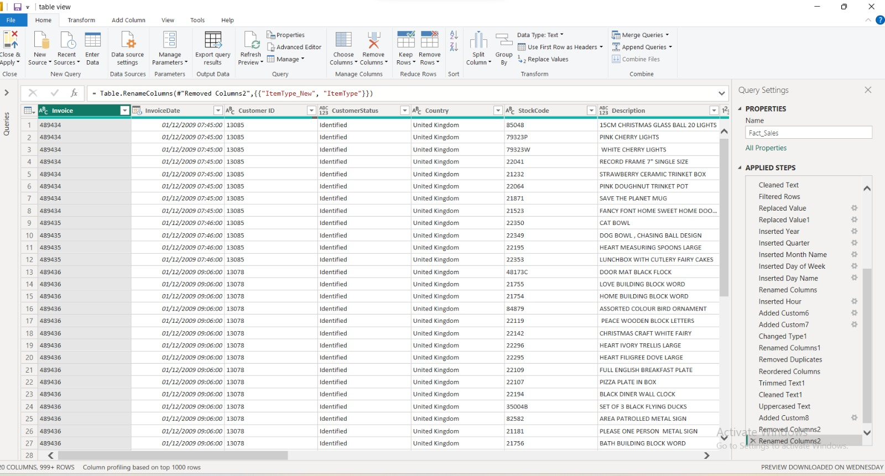

# Retail Sales Analytics | Power BI

## 📊 Project Overview

This is an end-to-end Retail Sales Analytics project developed using Power BI.

The project covers the complete data analytics workflow, starting from raw transactional data and progressing through data cleaning, transformation, data modeling, DAX calculations, and interactive dashboard development.

The final `Fact_Sales` table contains **1,033,034 transaction rows**.

---

## 📂 Dataset

**Source:** UCI Machine Learning Repository – Online Retail II

https://archive.ics.uci.edu/dataset/502/online%2Bretail%2Bii

The dataset contains transactional data for a UK-based online retailer covering the period from 2009 to 2011.

---

## 🔄 Project Workflow

Raw Data  
→ Power Query Cleaning  
→ Data Transformation  
→ Business Rules  
→ Star Schema Modeling  
→ DAX Measures  
→ Data Analysis  
→ Interactive Power BI Dashboard

---

## 🧹 Data Cleaning & Transformation

Power Query was used to prepare the data for analysis.

Key transformations included:

- Combining multiple retail datasets
- Correcting data types
- Handling missing customer IDs
- Removing duplicate transaction records
- Standardizing country values
- Cleaning product descriptions and Stock Codes
- Identifying sales and returned/cancelled transactions
- Creating transaction classifications
- Creating `LineAmount`
- Extracting Year, Quarter, Month, Day and Hour
- Creating customer identification status
- Separating real products from fees and operational adjustments

Transactions were classified into:

- **Product**
- **Service/Fee**
- **Adjustment/Non-Product**

This helped prevent postage, commissions, discounts, manual adjustments, damaged items and other non-product records from affecting product-level analysis.

### Power Query

---

## 🗂️ Data Model

A **Star Schema** was created to improve model organization, filtering and reporting.

### Fact Table

- `Fact_Sales`

### Dimension Tables

- `Dim_Product`
- `Dim_Customer`
- `Dim_Country`
- `Dim_Date`

A dedicated `_Measures` table was also created to organize DAX measures.

---

## 📐 DAX Measures

Some of the main measures developed include:

- Gross Product Sales
- Net Product Sales
- Return Value
- Return Rate
- Total Orders
- Returned Orders
- Total Customers
- Average Order Value
- Product Count
- Units Sold
- Returned Units
- Product Return Value Rate

---

# 📈 Dashboard

The final report consists of three analytical pages.

## 1. Executive Overview

Provides a high-level view of overall retail performance.

Key analysis includes:

- Net Product Sales
- Gross Product Sales
- Return Value
- Return Rate
- Total Orders
- Total Customers
- Monthly Net Sales Trend
- Top 10 Countries by Net Sales

---

## 2. Product Analysis

Focuses on product-level sales and return performance.

Key analysis includes:

- Net Product Sales
- Product Count
- Units Sold
- Returned Units
- Top 10 Products by Net Sales
- Top 10 Products by Return Value
- Sales vs Returns by Product

---

## 3. Customer & Sales Analysis

Analyzes customer behavior and sales patterns.

Key analysis includes:

- Net Product Sales
- Average Order Value
- Total Orders
- Total Customers
- Top 10 Customers by Net Sales
- Sales by Hour
- Sales by Day of Week
- Identified vs Unidentified Customer Sales

---

## 📋 Final Fact Table

The cleaned and transformed Fact table contains:

**1,033,034 rows**

---

## 🛠️ Tools & Technologies

- Power BI
- Power Query
- DAX
- Data Modeling
- Star Schema
- Data Cleaning
- Data Transformation
- Data Visualization
- Business Intelligence

---

## 🎯 Skills Demonstrated

`Power BI` `Power Query` `DAX` `ETL` `Data Cleaning` `Data Modeling` `Star Schema` `KPI Development` `Data Visualization` `Business Intelligence`

---

## 📁 Power BI File

The complete Power BI report is available in this repository:

`retail-sales-powerbi-analysis.pbix`

---

## 👤 Author

**Youssef Elshazly**

Data Analytics Portfolio Project
